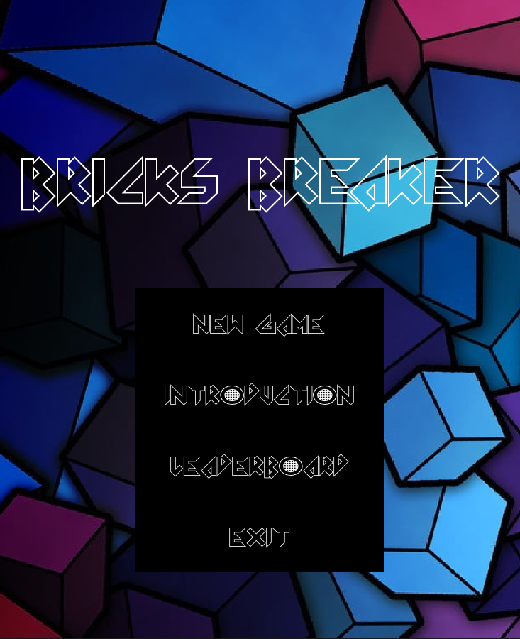
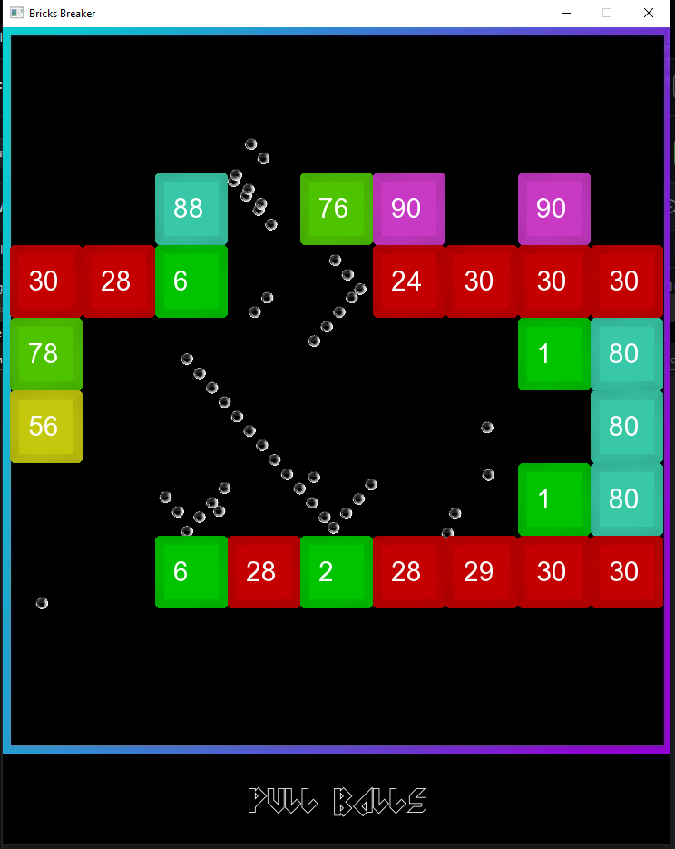

# <h1> General info </h1>
 The project was made so I could learn more about graphic libraries and APIs. So far the project is not finished yet and still requires a lot of work.
# <h1> Technologies used </h1>
 - C++ 20
 - SFML library
 - Dear Imgui
# <h1> Instalation </h1>
The instalation is very simple, just clone project. All dependancies and libraries should be already set up. The process was so far tested only in Visual Studio 2019 and 2022 on windows.
 
 
Main Menu : 

Gameplay : 

